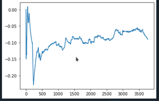

# Self-Driving-Car
This project contain programmatic implementation of a Self Driving Car using Deep Q- Learning. This car(or bot) doesn't requires any training set to train, it teaches itself and learns from its past experiences better than humans xD.

## Requirements(Libraries) :-
1. Kivy Module in python for GUI objects like car and map etc. You can install it via :-
For Anaconda Environment > 
```
conda install kivy -c conda-forge
```
For other environments > 
https://kivy.org/doc/stable/installation/installation-windows.html

2. PyTorch Module for our Neural Network and all other A.I. functionalities
For Anaconda Environment > 
```
conda install -c pytorch pytorch
```
For other environments > 
https://pytorch.org/get-started/locally/

3.Numpy Module for all mathematical purpose. It almost comes by default but you can install it via :-
For Anaconda Environment > 
```
conda install -c anaconda numpy
```
For other environments > 
```
pip install numpy
```
That's all extra Modules you need. NOw you are ready to autopilot the script xD.

## Getting Started :-

- Download or clone repository.

- Open cmd or terminal in same directory where all the files of this repo(**Map.py**, **Neural_Network_AI.py**, and **car.kv**) is saved(after cloning or downloading this repo).

- Just type **python3 Map.py** on cmd or terminal.

- It will then automatically launch a new window like shown below in **Output** section where our Self Driving Car will be doing its movement and learning from its experiences.


## Features and Extras

- There will 3 options on the GUI window opened after launching the program. Those are : **clear**, **save**, **load**.

- By **save** option you can save the brain of the car(bot) and actually visualise it on a graph which will automatically open whenever you save car brain(or memory of previous transitions).

- By **load** option you can see the last saved data of brain of car.

- Most interesting thing is that **you can actually draw anything on that GUI window using mouse**, and car will treat every curve or line that you draw as boundary and will try to not
not hit it. Initially it may hit the curves(boundaries) but eventually within a minute it will learn and will go on smooth without colliding or crossing the boundaries.

- By **clear** option you can clear the drawn curves on the GUI. Its basically like eraser.

## Outputs
Initially when you just run the program this is how it looks like


Drawing boundaries or curves with mouse


Graph to see our car mind



## Bugs and Improvements :-

- No known bugs.
- But in Spyder IDE you have to restart the kernel after running this program, to run this program again.(Shortcut for Restarting Kernel in Spyder IDE is **Ctrl + .** it works when your cursor is in IpythonConsole)

## Dev :- Prakash Gupta


